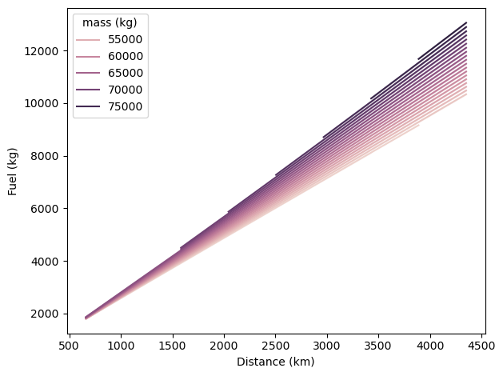

# Super fast *Poly*nomial *M*odel for Flight *E*mission *R*esearch

This is the simplest aircraft emission model that gives you fuel and co2 estimations based on the aircraft type, distance, and takeoff mass.

This reduced-order aircraft emission model is based on [OpenAP](https://openap.dev).


## Quick example


```python
from openap import polymer

flight = polymer.Flight("A320")

flight.fuel(distance=2000, mass=65000)  # in km and kg
flight.co2(distance=2000, mass=65000)

# or even simpler
flight.fuel(distance=2000)
flight.co2(distance=2000)
```

Visualize the actual model

```python
from openap import polymer

flight = polymer.Flight("A320")

flight.plot()
```


## Install


`openap.polymer` uses `openap.top` for generating flights with varying flight distances to construct a simplified fuel and emission calculation model.


1. Create a new conda environment (`openap-env`), which avoids messing up the base conda environment:

```sh
conda create -n openap-env python=3.10 -c conda-forge
```
2. Use the `openap-env` environment

```sh
conda activate openap-env
```
3. Install dependent libraries:

The most recent version of `openap` and `openap-top`:

```sh
pip install --upgrade git+https://github.com/junzis/openap
pip install --upgrade git+https://github.com/junzis/openap-top
```

4. Install `openap.polymer`

```sh
pip install --upgrade git+https://github.com/junzis/openap-polymer
```


